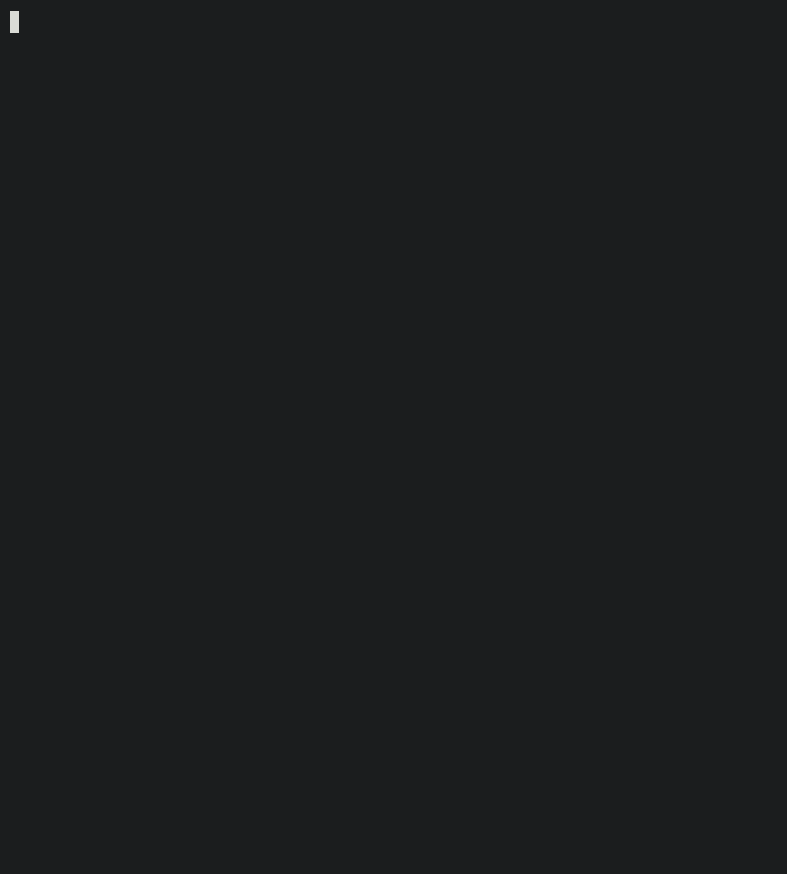

# SentryMesh Gateway

A simulated IoT security gateway: intrusion detection (replay, flood) on
simulated sensor traffic, with a Go gateway performing validation,
rate-limiting, and anomaly detection — backed by SQLite persistence and
a live terminal dashboard.

## Demo



The recording shows: legitimate telemetry accepted, an invalid payload
rejected, a captured message replayed by an attacker script, and a burst
of traffic escalating from throttling to a confirmed flood alert — all
visible live in the dashboard.

## Architecture

```
ESP32 (Wokwi, simulated) --WiFi/MQTT--> Mosquitto (Docker) --> Gateway (Go)
                                                                     |
                                           validation + rate-limit + replay detection
                                                                     |
                                                        SQLite persistence + TUI dashboard
```

The gateway acts as an application-level IPS for IoT telemetry: each
message is validated and screened for anomalies *before* it reaches
persistence or the dashboard — a rejected message never propagates
further downstream. It does not block at the network/session level
(the MQTT client itself stays connected, and traffic remains visible to
any other MQTT subscriber); detection and prevention happen at the
message level, not the connection level.

## Components

- **`firmware/esp32-sensor/`** — Simulated ESP32 + DHT22 sensor (Wokwi),
  publishing telemetry over MQTT with no broker authentication (by
  design — real security lives in the gateway, not the broker).
- **`attacker/`** — Python script (`uv` + `mise`) simulating `capture`,
  `replay`, and `flood` attacks against the MQTT topic.
- **`cmd/sentrymesh/`** — Single Go binary: MQTT ingestion, security
  pipeline, SQLite persistence, and the bubbletea dashboard, all in one
  process.
- **`internal/`** — `telemetry` (shared struct), `security` (validator,
  rate limiter, replay detector), `storage` (SQLite), `dashboard`
  (bubbletea TUI).

## Running it

### 1. Start Mosquitto (MQTT broker) in a container

```bash
docker run -it -p 1883:1883 eclipse-mosquitto
```

This exposes the broker on `localhost:1883`.

### 2. Expose the broker to the simulated ESP32 (Wokwi)

Wokwi's simulated WiFi cannot reach `localhost` directly, so the local
broker needs to be tunneled out. This project uses
[Pinggy](https://pinggy.io):

```bash
ssh -p 443 -R0:localhost:1883 tcp@a.pinggy.io
```

Pinggy prints a public host and port (they change on every run, since
this is the free tier) — set that address as the MQTT broker in the
ESP32 firmware (`firmware/esp32-sensor/esp32-sensor.ino`) before
launching the Wokwi simulation. The gateway itself always connects
directly to `tcp://localhost:1883`, since it runs on the same machine
as the broker.

> Known limitation: the free Pinggy tunnel introduces variable latency
> and disconnects after a few minutes of use — this is expected, not a
> bug. `mqttClient.setKeepAlive(60)` in the firmware helps but doesn't
> eliminate it entirely.

### 3. Run the gateway

```bash
go run ./cmd/sentrymesh
```

This opens the dashboard (`Tab` to switch between Overview and
Activity, `q` to quit). Logs (with timestamps) are written to
`sentrymesh.log` rather than the terminal, since the dashboard takes
over the screen.

### 4. Generate traffic

Either launch the Wokwi simulation (real firmware path), or publish
manually for quick testing:

```bash
mosquitto_pub -h localhost -t "sentrymesh/esp32-01/telemetry" \
  -m '{"device_id":"esp32-01","timestamp":1000,"temperature":24.0,"humidity":55.0}'
```

Or run the attacker script:

```bash
cd attacker
uv run attacker.py --mode capture
uv run attacker.py --mode replay
uv run attacker.py --mode flood
```

## Detection pipeline

Each incoming message passes through, in order:

1. **Validation** — plausible sensor bounds (temperature, humidity,
   non-empty device ID, non-zero timestamp).
2. **Replay detection** — timestamp must be strictly greater than the
   last seen for that device (ESP32 timestamps are `millis()`, a
   per-device monotonic counter since boot — never compared against
   wall-clock time).
3. **Rate limiting** — a low-threshold operational limiter (silent
   throttling) and a higher-threshold flood detector (distinct security
   alert), both sliding-window based.

A rejection at any stage stops the pipeline — a replayed or flooding
message never reaches SQLite or increments a "normal" counter.

## Testing

```bash
go test ./... -v
```

Unit tests cover the validator, rate limiter (with an injectable clock
for deterministic window-expiry tests), replay detector, and SQLite
store (in-memory database).

## Future work

- Alert filtering / detail view in the dashboard's Activity tab
- Network- or session-level blocking (current detection acts on
  individual messages, not on the connection — a malicious client
  stays connected to the broker even after repeated rejections)
- Configurable thresholds (currently hardcoded: rate/flood windows,
  validation bounds) via flags or a config file
- Support for multiple simulated devices to test per-device isolation
  under more realistic multi-sensor traffic
